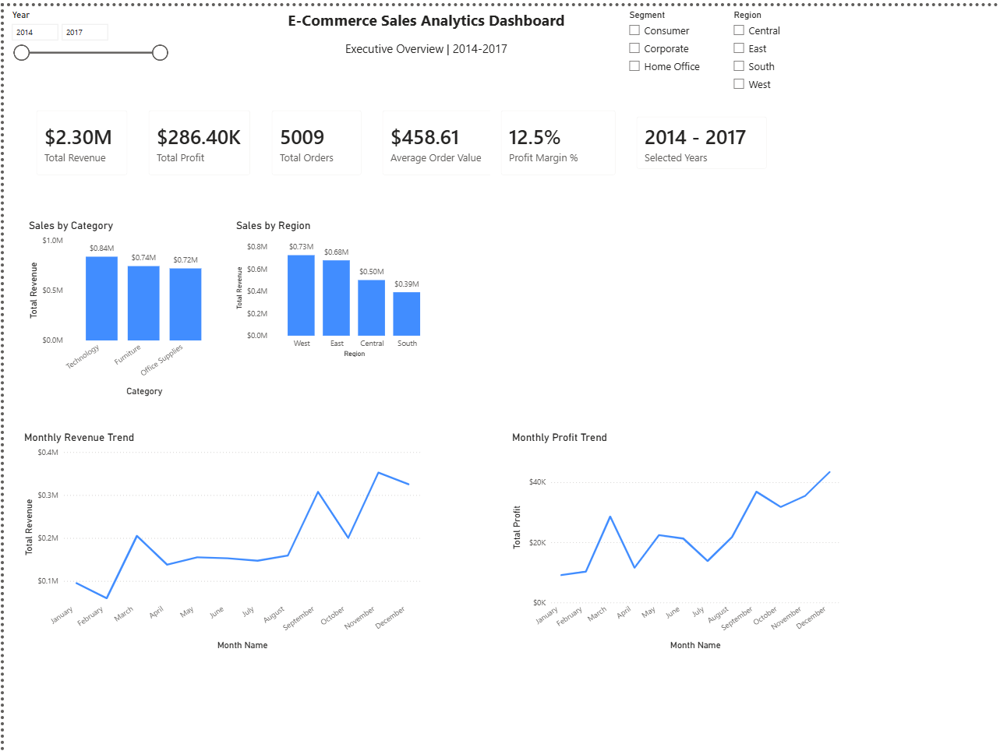
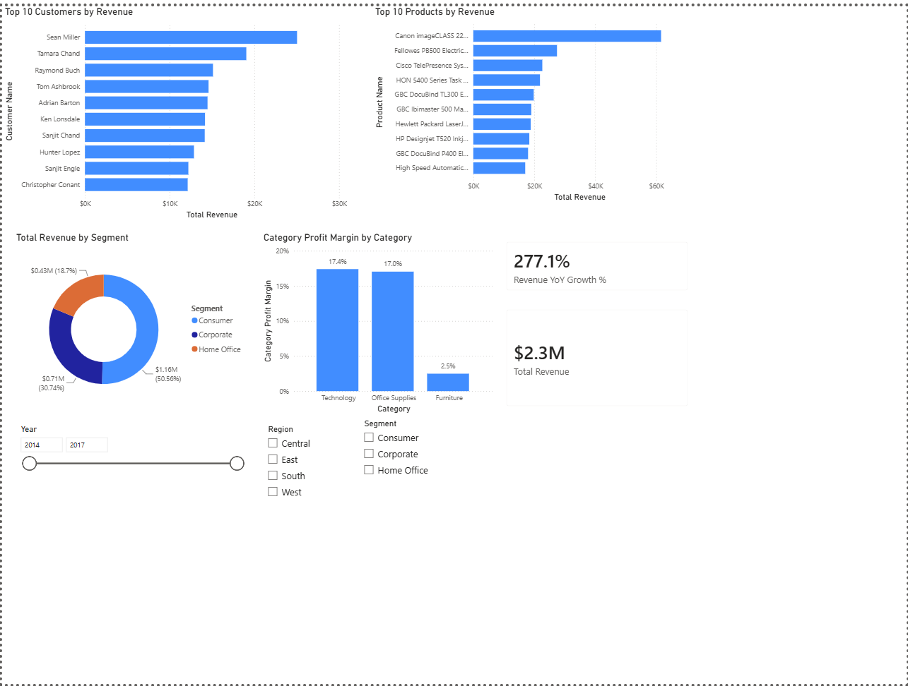

# 📊 E-Commerce Sales Analytics Dashboard | Power BI

An interactive **Business Intelligence dashboard** built using **Power BI** to analyze e-commerce sales performance, profitability, customer behavior, and regional trends. This project demonstrates end-to-end data analytics, including data cleaning, transformation, KPI development, and dashboard design.

---

## 🚀 Project Overview

This dashboard enables business stakeholders to monitor key performance indicators (KPIs), identify top-performing products and customers, analyze sales trends, and make data-driven decisions through interactive visualizations.

---

## 🎯 Objectives

* Analyze overall sales and profitability
* Track monthly sales and profit trends
* Evaluate regional and category-wise performance
* Identify top customers and products
* Monitor business KPIs
* Build an executive-level interactive dashboard

---

## 🛠️ Tech Stack

* **Power BI Desktop**
* **Power Query**
* **DAX (Data Analysis Expressions)**
* **Data Modeling**
* **Microsoft Excel / CSV**

---

## 📂 Dataset

* **Dataset:** Sample Superstore Dataset
* **Records:** 9,994 Transactions
* **Time Period:** 2014 – 2017

Dataset includes:

* Orders
* Customers
* Products
* Categories
* Regions
* Sales
* Profit
* Discounts

---

## 🧹 Data Preparation

Data preprocessing was performed using **Power Query**.

### Data Cleaning

* Corrected data types
* Fixed date formatting using locale settings
* Validated numeric fields
* Created Profit Margin column
* Generated Year, Month Name, and Month Number fields
* Prepared the dataset for reporting and analysis

---

## 📈 DAX Measures

Developed custom measures including:

* Total Revenue
* Total Profit
* Total Orders
* Average Order Value (AOV)
* Profit Margin %

---

## 📊 Dashboard Features

### Executive Dashboard

* 💰 Total Revenue KPI
* 📈 Total Profit KPI
* 📦 Total Orders KPI
* 💳 Average Order Value
* 📊 Profit Margin
* 📅 Monthly Revenue Trend
* 📅 Monthly Profit Trend
* 📂 Sales by Category
* 🌍 Sales by Region
* 🎛️ Interactive Slicers

  * Year
  * Region
  * Segment

---

### Deep Dive Analysis

* 🏆 Top 10 Products by Revenue
* 👥 Top 10 Customers by Revenue
* 🍩 Revenue Contribution by Segment
* 📊 Profit Margin by Category

---

## 📌 Key Business Insights

* 💰 Total Revenue: **$2.30M**
* 📈 Total Profit: **$286K**
* 📦 Total Orders: **5,009**
* 📊 Profit Margin: **12.47%**
* 🏆 Technology generated the highest revenue.
* 🌎 West region recorded the highest sales.
* 👥 Consumer segment contributed the largest share of revenue.

---

## 📸 Dashboard Preview

### Executive Dashboard

> Add screenshot here

```markdown

```

---

### Deep Dive Analysis

> Add screenshot here

```markdown

```

---

## 📁 Project Structure

```text
E-Commerce-Sales-Analytics-Dashboard-PowerBI
│
├── Dashboard
│   └── Ecommerce_Sales_Analytics.pbix
│
├── Dataset
│   └── Sample-Superstore.csv
│
├── Images
│   ├── Executive_Dashboard.png
│   └── Deep_Dive_Analysis.png
│
└── README.md
```

---

## 💼 Skills Demonstrated

* Business Intelligence
* Power BI Dashboard Development
* Power Query
* Data Cleaning
* Data Transformation
* Data Modeling
* DAX
* KPI Development
* Data Visualization
* Business Analytics
* Trend Analysis

---

## 📚 Business Questions Answered

* What is the total revenue generated?
* Which regions generate the highest sales?
* Which product categories perform the best?
* Who are the top customers by revenue?
* Which products contribute the most revenue?
* How does revenue change month-over-month?
* What is the company's profit margin?
* How does revenue vary across customer segments?

---

## 🔮 Future Enhancements

* SQL Database Integration
* Power BI Service Deployment
* Automated Data Refresh
* Customer Lifetime Value (CLV) Analysis
* RFM Customer Segmentation
* Sales Forecasting
* Row-Level Security (RLS)

---

## 👨‍💻 Author

**Ankit Arjunagi**

* LinkedIn: https://www.linkedin.com/in/ankit-arjunagi
* GitHub: https://github.com/AnkitArjunag

---

## ⭐ If you found this project useful, consider giving it a star!
